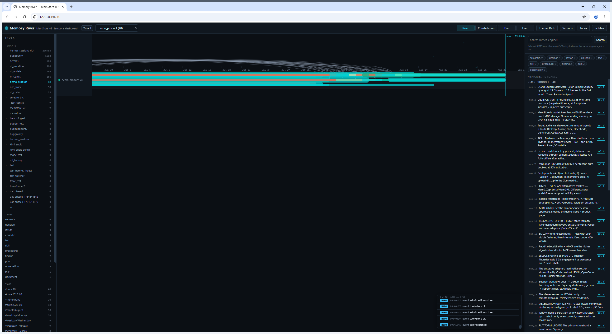
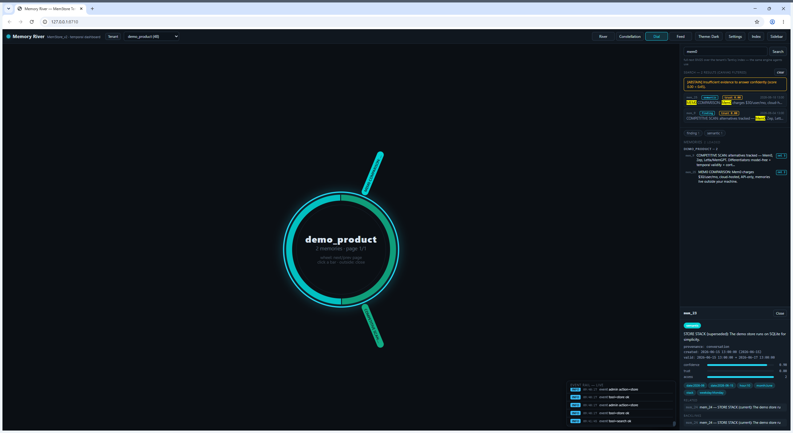

# MemStore

Durable memory for AI agents. Works offline. No LLM, no embeddings, no GPU, no cloud.

I built this because I kept running into the same problem: my agents have no
memory. You close the session and everything is gone. The existing options
didn't fit — vector DBs want an embedding model and a cloud account, and the
markdown-file approach just rots. So I wrote MemStore: a memory layer that
lives on your machine, speaks MCP, and doesn't need anything from the internet.

It's a single Python package. LMDB for storage, Tantivy/BM25 for retrieval,
and a small local dashboard called Memory River to see what your agents
remember. 14 MCP tools, one mental model. Claude Desktop, Cursor, Cline,
OpenCode, Gemini CLI, Codex, Kimi CLI, OpenClaw, Hermes — anything that speaks
MCP can use it, and they all share the same memory root, because tenants
follow projects, not tools.



## What it actually does

- **Persistent memory with time awareness.** Every memory carries `valid_from`
  and `valid_until`. Ask what was true last Tuesday and you get the answer
  that was true last Tuesday. Expired facts decay instead of polluting results.
- **Contradiction detection at write time.** Store "we switched to Postgres"
  and the older "we use MySQL" record gets flagged automatically. No LLM
  involved — it's keyword + phrase matching over the tenant index.
- **Branches, snapshots, 3-way merge.** Git-style versioning for memory.
  Experiment on a branch, diff it, merge it back.
- **Trust scoring and provenance.** Every record carries confidence, where it
  came from, and how often it's been accessed. Retrieval returns compressed
  evidence with `[ref: mem_N]` handles, not a token firehose.
- **Session capture (opt-in).** Adapters that read your agents' native session
  stores directly — Codex rollout JSONL, OpenCode SQLite, Cursor chats, Cline,
  OpenClaw trajectories, Gemini CLI. Deduplicated by content hash. Your
  conversations become searchable memory without any cloud in the middle.

```bash
python -m memstore autosave add C:\Users\you --platform codex --platform opencode --platform cline
python -m memstore autosave run --interval 300
```

## Memory River (the dashboard)

Ships with the product. Four views, dark theme, zero telemetry:

| View | What it shows |
|---|---|
| **River** | memories as capsules on a real time axis |
| **Constellation** | the memory graph with relation arcs |
| **Dial** | radial sunburst navigator |
| **Feed** | live event log of what your agents store |



## Benchmarks

I ran the official public agent-memory benchmarks (LoCoMo, BEAM) locally, all
numbers below are measured from artifacts in this machine's `benchmarks/results/`,
not quoted from a marketing page. Competitor numbers are from their own
published tables, linked in `benchmarks/COMPARISON.md` with dates.

| Benchmark | MemStore | Mem0 (published) |
|---|---|---|---|
| LoCoMo — evidence hit@10, all 1,986 QA | **0.619** | 92.5 (full-stack acc)
| LoCoMo — median latency | **12.8 ms** | p50 0.88 s
| LoCoMo — tokens per query | **0** | ~6,956
| BEAM (public 100K split) | **0.797** | — |
| &nbsp;&nbsp;· instruction following | **1.000** | — |
| &nbsp;&nbsp;· knowledge update | **0.950** | — |
| &nbsp;&nbsp;· temporal reasoning | **0.925** | — |
| &nbsp;&nbsp;· contradiction resolution | **0.750** | — |
| Golden queries R@10 (52 verified, in-house) | **1.000** | — |
| Median query latency (same box, vs my old neural stack) | **23 ms** | — |
| Scale stress, 50k memories, p95 query | **4.1 ms** | — |

### Why my LoCoMo number "looks low" next to Mem0's 92.5

Because they are not the same measurement, and I'd rather explain it than
hide it. Mem0's score is **end-to-end accuracy**: evidence goes into an LLM
(gpt-4o-class), the LLM writes an answer, and another LLM judge grades it.
MemStore has **no LLM anywhere** — it's a retrieval and evidence substrate, so
the honest contract I can measure is *evidence hit@k*: did the system return
the gold evidence. 0.619@10 means for 62% of the 1,986 questions the exact
gold evidence is in the top-10 results, plus an explicit `[ABSTAIN]` flag when
evidence is thin (abstain F1 has a measured ceiling — documented in
`benchmarks/COMPARISON.md`, not hidden).

If you bolt an answerer on top, you'd get an end-to-end number too. That's a
different product than what the competitors score — but the latency and cost
columns are the same axis for everyone, and that's where the no-LLM design
wins outright: 12.8 ms vs ~900 ms median, zero tokens vs ~7,000 per query.

### Where it's openly weak

Multi-hop joins (0.354), summarization-class questions (0.625), abstention
recall on adversarial QA. All documented with measurements. If you need
LLM-judged end-to-end scores, run your own answerer on top — the evidence
layer is what you're buying, and it's fast enough to sit in front of anything.

## Privacy

This is the part I actually care about, so it's simple:

- **Everything is local.** LMDB files on your disk. The only network call the
  product ever makes is the one-time license-key check. After that it runs
  fully offline, forever.
- **No telemetry.** No analytics, no crash reporting, no phone-home. There's
  nothing to opt out of.
- **Open code.** The full Python source ships in the zip. Read it, audit it,
  grep it for network calls (there's exactly one), change it. Your memory
  store is plain files — you can back it up, diff it, or walk away with it.
- **Multi-tenant by design.** Each project gets its own tenant with its own
  LMDB environment. Nothing cross-leaks.

## Speed

No model means no model latency. Numbers from this machine (see
`benchmarks/` for the harnesses, they're all in the box):

- median query **12.8–23 ms** depending on benchmark; p95 under 60 ms on
  50k-record tenants
- stores at **148–2,100 rec/s** depending on record shape
- cold start to first answer in **0.6 s** (no model weights to load — my old
  embedding stack took 26 s)
- ingest a 12 KB document in **0.5 s**

The honest summary: on the shared axes (latency, cost, offline operation,
exact-token recall) it beats the LLM-based stacks by an order of magnitude.
On LLM-judged end-to-end scores it doesn't compete, by design — see the
benchmarks section above.

## Works with your agents

The installer detects installed MCP clients and writes the config for each.
One memory root shared by every client. Tested against: Claude Desktop,
Cursor, Cline, OpenCode, Gemini CLI, Codex CLI, Kimi CLI, OpenClaw, Hermes.

## Install

Python 3.11+, Windows/Linux/macOS. That's the whole dependency list.

```powershell
Expand-Archive memstore_v5.3.0.zip -DestinationPath C:\MemStore
python C:\MemStore\install.py
```

The wizard sets up install type, data location, LMDB map size, and your
license key. It writes Start-menu shortcuts and an `MCP-CONFIGURATION.md` with
snippets for every detected client.

Health check: `python -m memstore doctor`

## Pricing

**$15 one-time. Lifetime license, all 5.x updates included.** Checkout and
license keys through Lemon Squeezy. Per-seat, use it on your own machines.

<a href="https://memstore.lemonsqueezy.com"></a>

## FAQ

**Does it send my data anywhere?** No. One-time license check, that's it.
Everything else is local files and local processes.

**How is this different from a vector DB?** No embeddings to run. You also get
the things vector stores don't do: temporal validity, contradiction detection,
branching, trust scoring, and BM25 that actually nails exact-token queries
(addresses, IDs, hashes) where dense retrieval fumbles.

**Why should I trust the benchmarks?** You shouldn't, blindly — the harnesses
ship with the product (`benchmarks/*.py`), run them yourself on your box.
The comparison doc lists every competitor number with its source and date.

**Refunds?** Lemon Squeezy standard buyer protection. Run `doctor` and the
wizard within a few minutes of install and you'll know if it's for you.

## Contact

- Issues: the [Issues](../../issues) tab
- Email: spliffspliff70@gmail.com
- [TikTok @spliff7777](https://tiktok.com/@spliff7777) ·
  [YouTube @MrSpliff77](https://youtube.com/@MrSpliff77) ·
  [X @cryptodreki](https://x.com/cryptodreki) ·
  Telegram @spliff7777

## License

Proprietary, one-time purchase per seat. See [LICENSE](LICENSE). Source ships
for transparency and self-audit; redistribution or resale isn't permitted.
